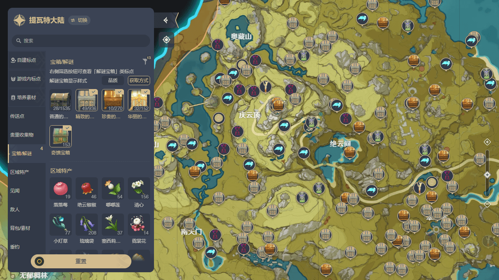

# 原神米游社大地图更换宝箱标点样式

---

## 安装

浏览器安装 [Tampermonkey](https://tampermonkey.net/) 或 [Violentmonkey](https://violentmonkey.github.io/) 插件后，前往 [Greasy Fork](https://greasyfork.org/zh-CN/scripts/463523) 安装

## 支持的地图

- 米游社 https://webstatic.mihoyo.com/app/ys-map-cn/index.html

## 功能

- 实时切换解谜宝箱的标点样式，可选择显示品质或获取方式
